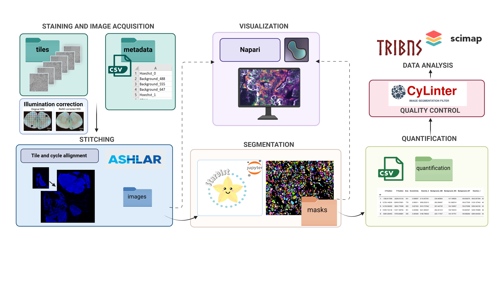

# Image_processing

This repository stores image processing scripts for Färkkilä lab, including stitching-segmentation-quantification steps. 



## Preparation

You should have conda installed on you device. Recommend miniconda. Create environment based on the yml files under folder ``envs``.

```
conda env create --name <name_of_your_environment> --file=<xx.yml>

# For example:
conda env create --name quantification --file=quantification.yml
```

You need to prepare conda environments for stitching, segmentation and quantification. Napari tools are recommended to be installed for visualize images.

## Run scripts

### Ashlar

Script: ``./pipeline/ashlar_workflow.py``

Open the script and modify ``my_path``, ``output_path`` and ``file_type`` based on your dataset. 

```
conda activate <your_environment_for_ashlar>
python ashlar_workflow.py -c 42 # 42 is the number of threads for parallel computation
```

If you have many cycles then consider decrease the number of threads (minimum 1). 


### Segmentation

Script: ``./pipeline/stardist_segmentation.py``

Open the file and modify ``INPUT_PATH``, ``OUTPUT_PATH`` based on your dataset.

```
conda activate <your_environment_for_stardist>
python stardist_segmentation.py
```

Note: We also provide jupyter notebooks if you want to visualize images while running the analysis: ``./pipeline/stardist_segmentation.ipynb``


### Quantification

Script: ``./pipeline/quantification_workflow.py``

Open the file and modify ``dir1``, ``dir2`` based on your dataset.

Besides you should also prepare ``channel.csv`` and create a new folder to store the output.

```
conda activate <your_environment_for_quantification>
python quantification_loop.py -o <output dir> -ch <channel.csv dir> -c 46 # 46 is the number of threads for parallel computation
```

If you have super large image then consider decrease the number of threads (minimum 1). 

---

If you have any problem, please contact: [ziqi.kang@helsinki.fi]()
